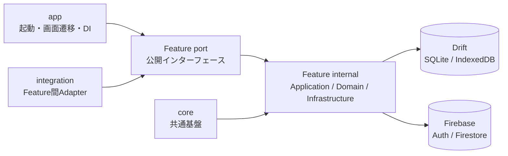
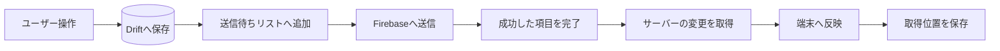

Flutter採用担当者が短時間で「設計力・実装力・品質」を判断できる流れがよいです。

## 1. **プロジェクト概要**
   - アプリの目的、主な利用者、解決する課題

   - スペイン語学習アプリ
   - 動詞の変化が多すぎて、語形変化した単語の原形を探すのすらも難しい
   - 動詞の変化の暗記
   - どのデバイスからでも、即座に続きから学習可能

## 2. **デモ**
   - スクリーンショットやGIF
   - 動作環境、試せるリンクがあれば掲載
一応WEBデモアプリはあるが、使用しているデータが公開しない方が良いものなので、スクリーンショットでの紹介に留める。
[➥Web版デモアプリ (https://my-dic-flutter-portfolio.web.app/)](https://my-dic-flutter-portfolio.web.app/)

  
  
  

  
  
  

## 3. **主な機能**
   - 単語検索。語形変化したままで検索
   - 日本語、スペイン語どちらからでも検索
   - クラウド同期で、学習進捗を複数デバイスで共有
   - 単語の語形変化をフラッシュカード形式で覚えるクイズ機能
   - 単語のブックマーク、学習済み管理
   - 自分で単語を追加可能（スラングなどやフレーズなど）

## 4. **技術構成**
    - Flutter / Dart
    - Riverpod（状態管理・DI）
    - GoRouter（ルーティング）
    - Drift（SQLite / IndexDb）
    - Firebase（Auth / Firestore）
    - Python（データ整備 / CLI）

## 5. **設計・実装上の工夫**
   - アーキテクチャ、ディレクトリ構成
   - 保守性、パフォーマンス、UXへの配慮
   - 技術選定の理由
### 設計

機能追加による影響範囲を限定できるよう、`search`、`quiz`、`my_word`、`word_status` などの機能単位でモジュールを分割しています。各Featureは公開契約である `port` と、実装を置く `internal` に分け、外部モジュールから内部実装やDBの型を直接参照できない構成にしています。

各ディレクトリの責務は次のように分けています。

- `app`: アプリの起動、ルーティング、セッション管理、Featureの組み立てを担当
- `features`: 検索やクイズなど、機能ごとの業務ロジックとUIを管理
- `integration`: 複数Featureの公開インターフェースを変換・接続するAdapterを配置
- `core`: DB、ログ、共通エラー型など、特定のFeatureに属さない基盤を提供

Feature内部では、画面と状態を扱う `Presentation`、ユースケースを実行する `Application`、業務ルールを表す `Domain`、DriftやFirebaseへ接続する `Infrastructure` に責務を分離しています。基本的な処理の流れは `Presentation → Application → Domain / Infrastructure` で、DB行やFirebase SDKの型を上位レイヤーへ漏らさず、公開DTOや `Result` 型へ変換して返します。

RiverpodはUIの状態管理に加えてDIにも利用しています。ただし、業務ロジックからProviderを直接参照せず、`app/bootstrap` をComposition Rootとして必要な依存を型付きで注入します。これにより、各レイヤーを単体でテストしやすくし、テスト時にはDBや外部サービスをFakeへ差し替えられるようにしています。

Feature間の参照は相手の `port` に限定し、連携に必要なデータ変換は `integration` が担当します。依存ルールはドキュメントだけに頼らず、Import Boundary Testによって `internal` への不正な参照やFeature間の密結合を自動検出しています。

### 同期設計

オフラインでも単語の登録や編集ができるように、変更内容は最初に端末内のデータベースへ保存します。同時に、サーバーへ送る内容を「送信待ちリスト（Outbox）」へ追加します。通信できない場合や途中でアプリを閉じた場合でも変更は端末に残るため、次回の同期で続きから送信できます。

同期処理は各Featureから分離し、`sync` Featureの共通ランタイムへ集約しています。1回の同期では、依存関係に基づいた順序で各データセットを処理し、次の流れを実行します。

1. 送信待ちリストから未送信の変更を取り出す
2. 変更内容をFirebaseへ送信する
3. 送信に成功した項目だけを完了にする
4. 前回の続きからサーバー側の変更を取得する
5. 取得した変更を端末へ反映し、次回の取得位置(時刻)を保存する

送信中のデータには一時的な処理権限（Lease）を付けています。送信中にアプリが終了しても、一定時間後に未送信の状態へ戻るため、次回もう一度処理できます。また、送信中に同じ単語が再編集された場合は、古い送信結果で新しい編集を完了扱いにしないよう、データの版番号も確認しています。

サーバーから変更を取得するときは、端末にまだ送信していない編集がないかを項目ごとに確認します。未送信の項目は上書きせず、それ以外の項目だけを取り込みます。これにより、端末で編集した内容を守りながら、別の端末で行われた変更も反映できます。

通信エラーが起きた場合は、少しずつ待ち時間を長くしながら自動で再試行します。何度試しても解決できないデータは別の場所（Dead Letter）へ移し、その1件が原因でほかの同期まで止まらないようにしています。再試行の回数や次に試す時刻も端末へ保存するため、アプリを再起動しても状態を引き継げます。

同じアカウントの同期が同時に複数動かないように制御しています。同期中に新しい同期要求が来た場合は、現在の処理が終わったあとにもう一度だけ実行します。また、処理の途中でログアウトやアカウント切替が行われた場合は同期を中止し、切替前のアカウントのデータが現在の画面へ反映されることを防ぎます。

各Featureは「どのデータを送るか」「取得したデータをどう保存するか」だけを担当します。送信待ちの管理、再試行、処理順序、アカウント切替時の中止などはSync側でまとめて管理しています。そのため、新しい同期対象を追加するときも、同じ仕組みを作り直す必要がありません。

## 6. **品質管理**
   - テスト、Lint、エラーハンドリング、CI/CDなど

## 7. **セットアップ方法**
   - 必要環境と、実行までの最短手順

## 8. **今後の改善点**
   - 分離と複雑化の再調整
   - coreの選別

   - UIUXいちからやり直し
   - 命名規則（一部不揃い）
   - 動詞「時制 × 主語」指定の例文検索
   - 例文中の単語タップ → 辞書へジャンプ
   - 忘却曲線アルゴリズムによるリマインド通知
   - 例文検索 / イディオム検索
   - AI を用いたスラング辞書生成
   - ~~myWord 同期~~
   - ~~オフライン同期プロセス強化~~
   - 検索アルゴリズム改善
   - 検索履歴

最後に、採用者向けREADMEでは「機能の多さ」よりも、**なぜその設計にしたか**と**どこを工夫したか**を具体的に見せるのが重要です。次はリポジトリを確認し、このプロジェクト固有のREADME構成に落とし込めます。
