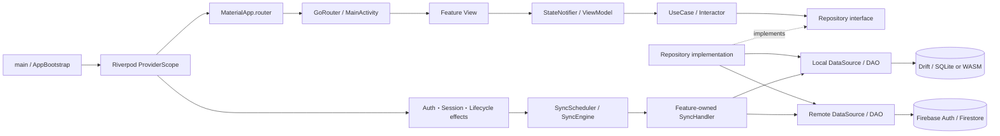

# 現状 Flutter アーキテクチャ調査レポート

調査日: 2026-08-07  
対象ブランチ: `refactor/rearch/phase1/v1`  
対象コミット: `c179598`

## 1. 調査条件

このレポートは、既存の README、`docs/` 配下、テスト説明書、機能説明用 Markdown を根拠にしていない。現時点の実装コードと実行結果だけを調査対象にした。

主な調査対象は次のとおり。

- `lib/` のアプリケーションコードと生成コード
- `pubspec.yaml`、`pubspec.lock`、`build.yaml`、`analysis_options.yaml`
- Android、Web、Windows のプラットフォーム設定
- `test/` のテストコード
- `.github/workflows/quality.yml` と import 境界チェッカー
- Firebase／Firestore、Drift、SharedPreferences の接続実装
- `flutter analyze`、`flutter test`、import 境界チェックの実行結果

調査開始時の worktree は clean だった。本レポート作成以外のソース変更は行っていない。

## 2. エグゼクティブサマリー

現状は、単一 Flutter package 内に全機能を置くモジュラーモノリスである。中心となる設計は次の組み合わせになっている。

- 機能単位の `features/*` と共有横断層 `core/*` を併用する feature-first 構成
- Riverpod による状態管理と手動 DI／composition
- View → ViewModel／StateNotifier → UseCase／Interactor → Repository interface → DataSource／DAO という Clean Architecture 風の処理経路
- Drift をローカルの正とし、Firestore へ outbox 経由で反映する local-first 同期
- Firebase Auth とローカル UserProfile を統合したアプリケーションセッション
- GoRouter の `StatefulShellRoute.indexedStack` による複数ナビゲーションスタック

ただし、依存方向が全体で一貫している厳密な Clean Architecture ではない。実際には `app`、`core`、`features`、トップレベルの `router` が相互参照し、新しい境界と旧来の共有実装が併存している。特に同期 composition には `app ↔ feature DI` の直接 import 循環がある。

現在の設計核を一文で表すと、次のとおりである。

> guest 利用も可能な辞書アプリを、account-scoped Drift database で動かし、認証済みユーザーの変更だけを Firebase と local-first 同期する、Riverpod ベースの feature-first モジュラーモノリス。

## 3. 全体構造



トップレベルの責務は次のように分かれている。

| パス | 実装上の責務 |
|---|---|
| `lib/app/` | 起動、アプリセッション、全体副作用、同期 composition、route contract、guest migration、feature 横断 UI adapter |
| `lib/core/` | 共通 domain、辞書 repository、Drift/Firebase 基盤、共通 UI、エラー／Result、旧来の共通 DI、Auth lifecycle |
| `lib/features/` | 機能別の presentation／domain／data／DI／sync handler |
| `lib/router/` | 実際の GoRouter 定義、route name/path、navigation service |
| `lib/__generated/` | Drift と Freezed の生成コード |
| `lib/main_activity.dart` | shell 共通 Scaffold と BottomBar、main/study branch の対応付け |

規模は以下のとおり。

| 区分 | Dart ファイル数 |
|---|---:|
| `lib/__generated` 外 | 524 |
| `app` | 25 |
| `core` | 198 |
| `features` 合計 | 292 |
| その他（entrypoint、router、platform helper 等） | 9 |
| `lib/__generated` 配下 | 19 |
| `lib` 合計 | 543 |

## 4. 起動とアプリケーションライフサイクル

起動経路は次の順序で固定されている。

1. `lib/main.dart:6-8`
   - Flutter binding を初期化する。
   - `AppBootstrap` を root widget として起動する。

2. `lib/app/bootstrap/bootstrap.dart:28-30,57-64`
   - `AppBootstrapper` が Firebase を初期化する。
   - 続いて SharedPreferences をロードする。
   - 失敗時は通常 UI へ進まず `BootstrapFailureApp` を表示する。

3. `lib/app/bootstrap/bootstrap.dart:43-51`
   - 初期化済み SharedPreferences を override した `ProviderScope` を作る。

4. `lib/app/bootstrap/bootstrap.dart:66-85`
   - Riverpod 管理の `DatabaseProvider` に `SELECT 1` を実行する。
   - DB が利用可能になってから application-wide effects を有効化する。
   - DB readiness が失敗した場合も `BootstrapFailureApp` を表示する。

5. `lib/app/bootstrap/lifecycle_effects.dart:18-36`
   - Firebase Auth stream の監視
   - AppSession と session fence の同期
   - sync scheduler の構築
   - `AppSessionReady` 通知時と app resume 時の foreground sync
   - Flutter lifecycle observer の登録

6. `lib/app/app.dart:13-34`
   - `MaterialApp.router` を構築する。
   - 全 route の上に `DatabaseLoadingOverlay` と `GuestMigrationPrompt` を重ねる。

長寿命リソースのライフサイクルは Riverpod が所有する。たとえば Drift connection は `lib/core/di/data/data_di.dart:24-30` で生成され、provider dispose 時に close される。GoRouter も `lib/router/router.dart:253-256` で dispose される。

## 5. モジュールとレイヤー

### 5.1 通常の feature 内部

比較的整っている feature では、依存は次の向きになる。

```text
presentation/view
  -> presentation/view_model
  -> domain/usecase interface + interactor
  -> domain/repository interface
       ^
       | implements
data/repository implementation
  -> local/remote datasource interface
  -> DAO
```

Riverpod provider は主に `features/<name>/di` で concrete implementation を組み立てる。戻り値は多くの経路で Freezed 製の `Result<T>` に統一され、失敗値は `AppError` 派生型として運ばれる（`lib/core/shared/utils/result.dart:8-13`、`lib/core/shared/errors/app_error.dart:1-18`）。

### 5.2 `app`

`app` は単なる UI root ではなく、複数 feature を束ねる composition root として機能している。

- `app/bootstrap`: process 初期化、lifecycle effects、sync、session fence
- `app/session`: Auth lifecycle を UI／Router 用の `AppSession` に投影
- `app/routing/contracts`: URL にシリアライズ可能な単語詳細／quiz route data
- `app/guest_migration`: guest scope から account scope への横断移行
- `app/presentation`: 検索結果、quiz、word status などの feature 横断 adapter

### 5.3 `core`

`core` は純粋な shared kernel には限定されていない。以下を同時に持つ。

- 共通 entity、repository interface、usecase、error、enum
- 辞書検索、活用、ランキング連携を含む concrete repository
- アプリ全体で共有する Drift database schema
- Firebase provider と一部 remote DAO
- Auth/User feature を束ねる application lifecycle
- 共通 Flutter widget、theme、loading overlay

したがって `core` は「最内層」だけではなく、共有 domain と infrastructure hub の両方である。

## 6. Feature カタログ

| Feature | Dart ファイル | 実装上の責務 | 主な層 |
|---|---:|---|---|
| `auth` | 30 | Firebase Auth、sign-in/up/out、email verification、認証画面 | data / di / domain / presentation |
| `user` | 34 | UserProfile、ローカル projection、Firestore 同期 | data / di / domain / presentation |
| `my_word` | 81 | ユーザー辞書 CRUD、status、guest/account scope、同期 | data / di / domain / presentation |
| `search` | 21 | 西日・日西・活用形検索 | di / domain / presentation |
| `word_page` | 9 | 単語詳細、辞書方向別表示、status/quiz の composition | di / presentation |
| `quiz` | 26 | quiz 検索／ゲーム、JSON と Drift の英語活用データ | consts / data / di / domain / presentation |
| `ranking` | 32 | 頻度ランキング、filter、pagination | data / di / domain / presentation |
| `esp_jpn_word_status` | 16 | 西日辞書の learned/bookmarked/note と同期 | data / di / domain |
| `jpn_esp_word_status` | 13 | 日西辞書の learned/bookmarked/note と同期 | data / di / domain |
| `word_status` | 2 | 両辞書方向で共有する direction/domain と status button contract | domain / presentation |
| `sync` | 28 | 同期 engine、ports、policy、queue/checkpoint/outbox adapter | application / infrastructure |

Feature ごとの自立度は一定ではない。

- `my_word` と `ranking` は View から data まで feature 内に比較的まとまっている。
- `search` は独自 data 層を持たず、`core` の辞書 repository／datasource を利用する。
- `word_page` は presentation composition feature で、`core` usecase、quiz、word status を横断利用する。
- `word_status` は独立機能というより二方向の status feature に対する共通 contract である。
- Dashboard は独立 feature ではなく、`lib/router/study.dart:13-24` の placeholder UI である。

## 7. 状態管理と依存注入

実際の状態管理／DI コンテナは Riverpod 2.6.1 である。

- immutable／read-only dependency: `Provider`
- 画面状態と command: `StateNotifierProvider`
- 単純な navigation/UI state: `StateProvider`
- DB や Auth の監視: `StreamProvider`
- 起動準備や一回読み込み: `FutureProvider`
- テスト差し替え: `ProviderContainer` と provider override

典型例は Search である。

- View が `searchViewModelProvider` を watch/read: `lib/features/search/presentation/view/search_fragment.dart:38-47,81-84`
- provider が ViewModel を生成: `lib/features/search/di/view_model_di.dart:7-13`
- ViewModel に usecase と navigation service を注入
- usecase provider が 3 repository を注入: `lib/features/search/di/usecase_di.dart:8-17`

`get_it` は dependency として解決されているが、`lib/` に直接利用箇所はない。Riverpod generator は使わず、provider は手書きされている。

例外として、Web database seed の loading 表示だけは `globalDatabaseLoadingNotifier` を process-global に生成し、それを Riverpod provider で包む（`lib/core/di/global.dart:3-4`、`lib/core/di/view_model/view_model.dart:6-9`）。したがって、すべての state instance が ProviderScope 内で生成されるわけではない。

## 8. 画面遷移

`lib/app/routing/router.dart` は application boundary 用の再 export であり、実体は `lib/router/router.dart` に残っている。

GoRouter の主要構成は次のとおり。

| Shell branch | Route | 画面 |
|---:|---|---|
| 0 | `/myword` 系 | My Word |
| 1 | `/search` 系 | Search、単語詳細、flash card |
| 2 | Dashboard route | Study Dashboard placeholder |
| 3 | Quiz route | Quiz search/game、単語詳細 |
| 4 | Ranking route | Ranking、単語詳細、flash card |

- 初期位置は Search: `lib/router/router.dart:129`
- 5 branch の `StatefulShellRoute.indexedStack`: `lib/router/router.dart:132-217`
- Profile/Auth は shell 外の root route: `lib/router/router.dart:219-249`

ユーザーに見える bottom navigation は My Word／Search／Study の 3 カテゴリだが、GoRouter は 5 branch を保持する。`MainActivity` が Study 内の Dashboard／Quiz／Ranking と shell index を相互変換する（`lib/main_activity.dart:28-47,67-123`）。そのため、各 branch の navigation stack は indexed stack 内で維持される。

単語詳細と quiz game は plain Dart の route contract で path/query parameter を生成・検証する。

- `WordDetailRoute`: `lib/app/routing/contracts/word_detail_route.dart:7-53`
- `QuizGameRoute`: `lib/app/routing/contracts/quiz_game_route.dart:4-30`
- 不正 parameter は `InvalidRoutePage` に変換される。

feature ViewModel は route contract を生成する一方、遷移の実行はトップレベルの具象 `AppNavigatorService` に依存する（例: `lib/features/search/presentation/view_model/viewmodel.dart:12-20`）。

`AppNavigatorService` は GoRouter の現在 location ではなく、別の `entryPointProvider` から named route prefix を決める（`lib/router/navigator_service.dart:20-44`）。authorized profile route は `ProfilePage(uid: "uid")` という固定値を渡すが、現在の ProfilePage はその引数を表示／保存に使わず `appSessionProvider` から account/profile を読む（`lib/router/router.dart:239-246`、`lib/features/user/presentation/view/profile.dart:49-59`）。

## 9. 認証、セッション、guest 利用

### 9.1 認証状態

Firebase Auth の `userChanges()` を直接 Router の真偽値にするのではなく、Auth と UserProfile を統合した lifecycle state を持つ。

```text
FirebaseAuth.userChanges
  -> ObserveAuthStateUseCase
  -> authStreamProvider / authEffectProvider
  -> AuthLifecycleController
  -> AuthLifecycleState
  -> appSessionProvider
  -> Router / UI / CurrentSession / Sync
```

`AuthLifecycleState` は initializing、signed out、signing in、email unverified、profile provisioning、ready、failure などを区別する（`lib/core/application/auth_lifecycle/auth_lifecycle_state.dart:5-69`）。verified identity では Firestore の User document を確保し、SharedPreferences の device ID と Drift のローカル profile を合成してから ready になる。`appSessionProvider` はこれを UI 向け sealed state に変換し、ready 時は account-scoped Drift UserProfile stream も投影する（`lib/app/session/session_providers.dart:13-49`）。

Feature は Firebase Auth repository ではなく `CurrentSession` port から `accountIdOrNull` を取得できる（`lib/app/session/current_session.dart:1-21`）。

### 9.2 Router の認可範囲

セッション redirect は Profile route に対して行われる（`lib/router/router.dart:99-128`）。辞書検索、quiz、ranking、My Word は `AppSessionReady` でなくても利用可能である。signed-out だけでなく email-unverified、profile-loading、provisioning failure など、Ready 以外では `CurrentSession.accountIdOrNull` が `null` になり、feature write は guest scope を使う。

guest scope の固定 ID は `legacy_unowned` であり、Firebase には送られない（`lib/core/shared/consts/account_scope.dart:1-9`）。

### 9.3 Guest migration

ready session を検出すると、root overlay の `GuestMigrationPrompt` が guest-owned row の存在を確認する。ユーザーが承認した場合、UserProfile、両辞書方向の status、MyWord、MyWordStatus を単一 Drift transaction 内で account scope に移し、必要な outbox mutation も同時生成する（`lib/app/guest_migration/migrate_guest_data_usecase.dart:65-87`）。

移行は session epoch を検査し、途中で account が変わった場合は transaction を rollback する。成功後は明示的な foreground sync を開始する（`lib/app/guest_migration/presentation/guest_migration_prompt.dart:88-99`）。

## 10. データ／永続化

### 10.1 ローカル database

Drift を利用する feature は 1 つの `DatabaseProvider` を共有する。schema version は 7 で、19 table が登録されている（`lib/core/infrastructure/database/drift/database_provider.dart:56-102`）。概念上は次の 4 群である。

- 辞書マスタ: 西日 words/dictionaries/examples/idioms/supplements/conjugations/part-of-speech lists、日西 words/dictionaries/examples、英語活用、rankings
- ユーザー所有データ: 両方向の word status、MyWords、MyWordStatus、UserProfiles
- 同期メタデータ: SyncOutbox、SyncCheckpoints
- migration／revision 情報: accountId、localRevision、remoteRevision、deletedAt、lastMutationId を各 owned table に保持

owned table の primary key は `accountId + entityId` が基本である。たとえば MyWords は `{accountId, myWordId}`、両辞書 status は `{accountId, wordId}` で分離される。

platform ごとの executor は次のとおり。

- Android／Windows: file-based `NativeDatabase`
- Web: `sqlite3.wasm` と `drift_worker.js` を使う `WasmDatabase`
- Native の初回起動: asset database を application support directory にコピー
- Web の初回起動: gzip JSON asset から Drift table を seed

### 10.2 Remote

- 認証: Firebase Auth
- remote data: Cloud Firestore
- root user document: `/Users/{accountId}`
- subcollections: `WordStatus`、`JpnEspWordStatus`、`MyWords`、`MyWordStatus`

Firestore rules は owner account の read/create/update のみを許可し、物理 delete を許可しない。MyWords の削除経路は `deletedAt` tombstone を書く（`lib/features/my_word/data/repository_impl/my_word_repository.dart:168-185`）。status dataset 全般に同じ delete contract があるわけではない。

現状の MyWordStatus contract には境界間の不一致がある。local repository は `hasNote` を outbox payload／field mask に含めるが（`lib/features/my_word/data/repository_impl/my_word_status_repository.dart:50-72`）、Firestore rules の MyWordStatus allow-list と remote DTO には `hasNote` がない（`firestore.rules:118-131`、`lib/features/my_word/data/data_source/remote/status/firebase_my_word_status_dto.dart:8-65`）。したがって `hasNote` を含む mutation は現在の rules contract を満たさず、remote pull modelにも対応フィールドがない。

### 10.3 SharedPreferences

SharedPreferences は bootstrap 前に取得され、provider override される。User provisioning に使う device ID と旧 sync status などの軽量永続化に使われるが、account-owned entity と新同期 checkpoint の中心は Drift である。

## 11. Local-first 同期

同期対象は次の 5 dataset である（`lib/core/shared/enums/sync_dataset.dart:4-9`）。

1. `esp_jpn_word_status`
2. `jpn_esp_word_status`
3. `my_words`
4. `my_word_status`
5. `user_profile`

`my_word_status` は `my_words` の成功に依存する（`lib/features/sync/application/policy/dataset_plan.dart:8-13`）。

### 11.1 書き込み経路

MyWord 登録を例にすると次の順序になる。

```text
View / command
  -> RegisterMyWordInteractor
  -> CurrentSession で account scope を決定
  -> MyWordRepository
  -> Drift transaction
       1. local row を即時 insert/update/tombstone
       2. 認証済みなら SyncOutbox に mutation を enqueue
  -> 成功 callback が MyWord list state を reset／再取得
     （個別 row は local StreamProvider から更新）
```

実装根拠は `lib/features/my_word/domain/usecase/my_word/create/register_my_word/register_my_word_interactor.dart:16-30` と `lib/features/my_word/data/repository_impl/my_word_repository.dart:113-146` である。update/delete も同じ local write + outbox の構造を取る（同ファイル `168-232`）。guest write は local のみで、後の guest migration 時に account mutation へ変換される。

### 11.2 同期実行

production composition は `lib/app/bootstrap/sync_composition.dart:20-65` にあり、次を構築する。

- DriftSyncQueue
- DriftSyncCheckpointStore
- DriftOutboxWriter
- InMemorySessionFence
- SingleFlightCoordinator
- feature-owned 5 SyncHandler の registry
- SyncEngine と SyncScheduler

実行時の順序は次のとおり。

```text
Lifecycle trigger
  -> SyncScheduler.foreground
  -> SyncEngine.runOnce
  -> DatasetPlan 順に handler 実行
  -> pending mutation を lease
  -> Firestore transaction へ push
  -> ack / retry / dead-letter
  -> remote delta を pull
  -> in-flight local field を保護して Drift へ反映
  -> account + dataset ごとの checkpoint を更新
```

Engine は同一 account の同時実行を single-flight にし、重なった trigger に対して 1 回の rerun request を記録する。session fence の `accountId + epoch` が変わった cycle は cancel する（`lib/features/sync/application/sync_engine.dart:25-103`）。Queue は lease、attempt count、next attempt、dead letter state を Drift に保持する。

Outbox writer は同じ account／dataset／entity の pending mutation を payload と field mask 単位で coalesce する（`lib/features/sync/infrastructure/persistence/drift/drift_outbox_writer.dart:13-47`）。5 handler の既定値は 1 trigger あたり最大 50 mutation、lease 2 分である。remote acknowledgement 後の local metadata 更新と queue ack、remote pull の local 適用と checkpoint 更新は、それぞれ同一 Drift transaction にまとめられる。

Firestore 側の共通 mutation transaction は `lastMutationId` による重複排除、古い `clientUpdatedAt` の supersede、field-mask merge、remote revision の加算、server timestamp の付与を行う（`lib/core/infrastructure/database/firebase/remote_mutation_transaction.dart:15-77`）。

現在コード上で確認できる新 SyncEngine の trigger は以下である。

- `appSessionProvider` が `AppSessionReady` を通知した時
- app が resumed になった時
- guest migration が完了した時

session listener は `fireImmediately: true` で、判定は遷移元ではなく `next is AppSessionReady` である。したがって初回 ready だけでなく、Drift profile stream の更新に伴う Ready → Ready の再通知でも foreground sync が起動し得る（`lib/app/bootstrap/lifecycle_effects.dart:32-36`）。

通常の MyWord／status write は outbox enqueue までで scheduler を直接呼ばない。新 SyncEngine に対する timer、background periodic task、remote listener の trigger は実装から確認できない。

旧 `SyncService` と `autoSyncProvider` もファイルとして残るが、production の `syncServiceProvider` は空の usecase list で作られる（`lib/features/sync/di.dart:7-30`）。MyWord／MyWordStatus の旧 `ISyncUseCase` provider と repository の直接 Firebase CRUD も残るが、現行 presentation／SyncEngine の handler registry には登録されていない。したがって、dataset を実際に処理する production 経路は新しい SyncEngine 側である。

## 12. 代表的な読み取りフロー

Search は feature 内に data 層を持たず、共有辞書基盤へ降りる。

```text
SearchFragment
  -> searchViewModelProvider
  -> SearchViewModel
  -> SearchWordInteractor
  -> core の IEsjWordRepository / IJpnEspWordRepository / IConjugationsRepository
  -> concrete Drift repository
  -> datasource
  -> DAO
  -> DatabaseProvider
```

根拠:

- `lib/features/search/presentation/view/search_fragment.dart:81-84`
- `lib/features/search/di/view_model_di.dart:7-13`
- `lib/features/search/di/usecase_di.dart:8-17`
- `lib/features/search/domain/usecase/search_word/search_word_interactor.dart:8-19`
- `lib/core/di/data/repository_di.dart:17-50`
- `lib/core/di/data/datasource.dart:17-55`

検索本体と ranking／meaning／star count の repository call、ならびに最終 `SearchWordOutputData` の合成は `SearchWordInteractor` が担う。各 repository は個別情報を返し、一部の concrete repository はさらに複数 local datasource を合成する。したがって Search の orchestration は feature domain にあり、保存技術と一部の辞書 aggregate 実装は `core/infrastructure` にある。

単語詳細側では `WordPageFragment.build()` から fetch が起動される（`lib/features/word_page/presentation/view/word_page_fragment.dart:65-93`）。これは現在の Widget lifecycle に組み込まれた読み取りトリガーである。quiz state の初期化は build 時ではなく、同画面の FAB `onPressed` 時に行われる（同ファイル `106-115`）。

## 13. 実際の依存関係と境界

### 13.1 成立している境界

- 多くの feature domain は repository interface に依存し、concrete data implementation は DI で差し込まれる。
- Firebase SDK import は主に bootstrap、infrastructure、feature data に置かれ、presentation から直接呼ばない。
- 新同期の engine は Firebase／Drift を直接 import せず、port と handler registry に依存する。
- route parameter は plain Dart contract に分離されている。
- `CurrentSession` により account 解決を Firebase Auth から分離している。

### 13.2 `app ↔ features` の直接循環

`app/bootstrap/sync_composition.dart` は各 feature の sync handler provider を import する。一方、次の feature DI は outbox／queue provider を得るため同じ `sync_composition.dart` を import する。

- `lib/features/my_word/di/data_di.dart:2`
- `lib/features/user/di/data_di.dart:2`
- `lib/features/esp_jpn_word_status/di/di.dart:2`
- `lib/features/jpn_esp_word_status/di/di.dart:3`

これは概念上だけでなく、Dart file import として存在する双方向依存である。

また複数の feature domain usecase が、account 解決 port として `app/session/CurrentSession` を直接 import する。実装は Firebase から分離されている一方、layer path 上は domain → app の依存になっている。

### 13.3 `core ↔ features`

Feature は広く core を参照するが、core も feature の型と実装を参照する。

- 共通 Drift database が MyWord／Ranking 所有の table と DAO を import
- core の辞書 repository が Ranking datasource を import
- core Auth lifecycle が Auth／User の usecase、DI、presentation store を import
- core の remote status datasource／DAO が feature の entity と sync model を import

よって `core` は feature 非依存ではなく、module graph 上は双方向である。

### 13.4 Feature 間依存

確認できる主な横断依存は次のとおり。

- Quiz → Search domain/usecase
- Ranking presentation → Quiz の card state
- WordPage → Quiz と WordStatus
- User → Auth
- MyWord → Auth/User と Sync ports/models
- account-owned feature → Sync application contracts

presentation 同士を全面共有する設計ではなく、主に domain contract、定数、sync contract を再利用しているが、一部 UI/具象 service 参照も存在する。

### 13.5 Router 境界

Router は app session と各 feature View を importし、feature ViewModel は具象 navigation service を importする。そのため `app → router → feature` の一方向 composition にはなっておらず、routing も横断結合点になっている。

## 14. Platform、build、code generation

### 14.1 SDK と主要 package

- `pubspec.yaml` の Dart constraint: `^3.6.0`
- lockfile が要求する実効下限: Dart 3.9.0 / Flutter 3.35.0
- 調査時のローカル環境: Flutter 3.38.9 stable / Dart 3.10.8
- Riverpod 2.6.1
- GoRouter 17.0.1
- Drift 2.30.0
- Firebase Core 4.2.1 / Auth 6.1.2 / Firestore 6.1.0
- SharedPreferences 2.5.4
- Freezed 3.2.3

package version は `pubspec.lock` の解決値である。CI はこの Flutter version を pin せず、`stable` channel を指定する。

### 14.2 対象 platform

platform scaffold とローカル Firebase options の両方を確認できる対象は Android、Web、Windows である。各 platform build の成功は今回検証していない。iOS、macOS、Linux の directory はなく、`DefaultFirebaseOptions` もこれらを `UnsupportedError` にする（`lib/firebase_options.dart:8-37`）。

- Android: Flutter SDK 値に compile/min/target SDK を委譲
- Web: Drift WASM asset、PWA manifest、ローカル `firebase.json` 上の Firebase Hosting SPA rewrite
- Windows: CMake/C++ runner と Firebase／SQLite plugin registration

Android scaffold には namespace `com.example.my_dic` と applicationId `com.my_dic` が併存し、異なる package path の `MainActivity.kt` が 2 本ある。release build が参照する `android/app/proguard-rules.pro` は存在しない。また Gradle wrapper script/jar はローカルに存在するが ignore 対象である。これらを含む Android build の成否は未検証である。

### 14.3 生成コード

`build.yaml` は `.g.dart` と `.freezed.dart` の出力を `lib/__generated/` に集約する。同 directory 配下の追跡済み生成 Dart は 19 ファイルである。

- Drift database: 1
- DriftAccessor: 17
- Freezed `Result<T>`: 1

`json_serializable` は dependency にあるが、現コードに `@JsonSerializable` の利用はない。CI には build_runner 実行や生成差分確認はない。

### 14.4 tracked repository とローカル実行状態

現在のローカル working copy には以下が存在するが、`.gitignore` 対象であり Git 追跡外である。

- `lib/firebase_options.dart`
- `android/app/google-services.json`
- `assets/*.db` の辞書 database
- `assets/db_for_web/*.json.gz` の Web seed
- `firebase.json`

用途と必要になる処理はそれぞれ異なる。

- `firebase_options.dart`: Dart source が直接 importし、解析／コンパイルに使う。
- `google-services.json`: Google Services plugin を使う Android build の入力になる。
- DB／gzip seed: `pubspec.yaml` が asset として直接列挙し、asset bundle と runtime seed に使う。
- `firebase.json`: Firebase CLI の hosting／emulator／deploy 設定であり、通常の Dart analyze/test の入力ではない。

現在の GitHub Actions は `flutter pub get`、analyze、boundary check、test のみで、これらの取得／生成処理を持たない。したがって、今回のローカル working copy で確認した analyze/test の PASS は、tracked files だけの clean checkout と同一条件ではない。clean checkout 上の workflow 全体は今回実行していない。

## 15. テストと品質ゲートの現状

### 15.1 テスト構成

`*_test.dart` は 44 ファイルである。

| 種別 | ファイル数 |
|---|---:|
| unit | 41 |
| widget | 1 |
| security source-scan | 1 |
| import-boundary tool test | 1 |

主な検証対象は次のとおり。

- Auth lifecycle、session projection、profile provisioning
- UseCase と ViewModel
- Drift schema v1-v5 から v7 への migration
- account scope と composite key isolation
- local write と outbox enqueue の同一 transaction contract
- sync queue lease／ack／retry／dead letter
- field-mask patch、checkpoint、session switch cancellation
- guest migration の atomicity
- logging call 内の機密語／識別子名と `.refreshToken` の字面に対する regex source scan

`integration_test/`、`test_driver/`、E2E runner 設定、coverage 設定、platform build test は確認できない。Firestore emulator 設定はローカルにあるが、現在の test／CI からは起動されない。

### 15.2 実行結果

2026-08-07 の実測結果:

| コマンド | 結果 |
|---|---|
| `flutter analyze` | PASS: No issues found |
| `flutter test` | PASS: 270 tests |
| import boundary check | FAIL: baseline にない 7 件を検出 |

import 境界チェッカーの現在値は、tool 上 48 件である。

- `core_no_feature`: 29
- `domain_no_framework`: 19
- baseline 済み: 41
- 新規検出: 7

新規 7 件はすべて `core` の Firebase／status infrastructure から `features/sync/application/model/remote_mutation.dart` への import である。ローカル working copy で個別実行した analyze と test は PASS したが、同じ状態で quality workflow を順に実行すると boundary step が exit 1 になり、後続の test step へは進まない。さらに tracked-only checkout は前節の ignored input がない別条件であり、実際の GitHub Actions run がどの step まで進むかは今回検証していない。

なお、baseline の一部には全行 comment-out された `lib/core/application/coordinator/auth_user_coordinator.dart` の import も記録されている。したがって「48」は境界ツールの検出レコード数であり、active compiler dependency の件数と完全には一致しない。active な循環／横断依存は本レポート 13 章で別に記述した。

## 16. 現状アーキテクチャの総括

現状の強い中心軸は以下である。

- Riverpod を composition と state propagation の共通基盤にしている。
- guest と signed-in account を同じ local database 上で明示的に scope 分離している。
- account-owned write は local transaction を先に成立させ、outbox で remote と収束させる。
- sync は queue、checkpoint、field mask、revision、session fence、single-flight を持つ独立 application subsystem になっている。
- Auth identity と UserProfile を統合した session model を Router／UI／Sync が共有する。

同時に、現在の module topology は移行途中のハイブリッドである。

- feature の完成度と layer 構成が均一ではない。
- `core` が shared kernel と concrete infrastructure hub を兼ねる。
- top-level `router` と `app/routing` が併存する。
- 旧 SyncService の scaffold と新 SyncEngine が併存する。
- `app ↔ feature DI`、`core ↔ features`、`router ↔ features` に双方向参照がある。
- 調査時のローカル working copy では analyzer/test が通るが、architecture boundary gate は失敗している。
- ローカル動作に必要な一部設定／大容量 seed asset は tracked repository 外にある。

以上が、改善案を加えず実装コードから復元した現状構成である。改善対象、優先順位、移行順序は次段の改善レポートで別途扱う。
