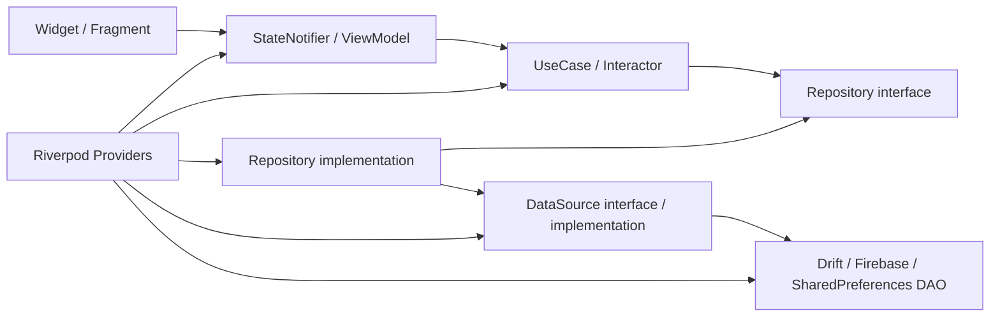

# Flutter `lib/` アーキテクチャ調査報告

- 調査日: 2026-08-04
- 対象: `lib/` 配下を中心に、起動設定、依存関係、`pubspec.yaml`、`analysis_options.yaml`、`test/` も確認
- 調査目的: 現在のアーキテクチャを特定し、責務境界が曖昧な箇所、成立していない設計、リファクタ前に対処すべき問題を明らかにする
- 変更範囲: 本報告書の追加のみ。アプリケーションコードは変更していない

## 1. 結論

このプロジェクトが目指しているのは、README に記載された **Feature Module × Clean Architecture × MVVM × CQRS** である。実装も、各 feature 内の `presentation / domain / data / di`、Repository interface、Interactor、Riverpod DI など、その方向を明確に意識している。

一方、現在の実態は次のように評価するのが正確である。

> **feature-first の縦割り構造と、`core` の横断レイヤ構造が混在した、レイヤード・モジュラーモノリスの移行途中**

Clean Architecture の部品は存在するが、依存方向を守る規則がなく、`core` と feature、feature 同士が相互参照している。そのため、フォルダ構造ほどには責務が分離されていない。特に同期・認証・DB migration には、設計上の問題だけでなく、データ欠落や認証情報漏えいにつながる実装上の問題がある。

### 総合評価

| 観点 | 評価 | 要約 |
| --- | --- | --- |
| Clean Architecture | 部分成立 | Port / Repository / Interactor / DI はあるが、`core -> feature`、domain -> Flutter、feature 間循環がある |
| Feature Module | 部分成立 | feature 単位の配置はあるが、70 本・23 方向の feature 間直接 import があり、4 組は双方向依存 |
| MVVM | おおむね成立 | Widget、StateNotifier、UI State の分離は見える。ただし ViewModel が別 feature の View 型や Router 実装を知る |
| CQRS | 限定的 | Stream による状態監視と Command の分離は一部にあるが、read model と write domain の境界は未整理 |
| DI | 部分成立 | Riverpod で構築しているが、`Ref` を保持する Coordinator / Navigator、static singleton、global notifier が hidden dependency を作る |
| テスト容易性 | 不十分 | Repository port は有効。ただし同期・migration・routing が未テストで、`test/**` は analyzer 対象外 |
| リリース安全性 | 要改善 | refresh token のログ出力、migration の確実なデータ欠落、同期カーソル共有による取りこぼしがある |

## 2. リファクタ前に止血すべき事項

以下は将来の美化ではなく、先に修正と回帰テストが必要な項目である。

| 優先度 | 問題 | 主な影響 |
| --- | --- | --- |
| P0 | Firebase refresh token をデバッグログへ出力 | 認証情報漏えい |
| P0 | DB v5 migration で MyWord status が全件失われる | 既存ユーザーデータ消失 |
| P0 | 全同期対象が単一の最終同期日時を共有 | リモート更新の恒久的な取りこぼし |
| P1 | Sign Up 成功時に確認メールを送らず、UI は送信済みと表示 | 認証フロー不成立、ユーザー誤認 |
| P1 | `Result.runtimeType` の誤判定が多数ある | エラー無視、後続の null assertion によるクラッシュ |
| P1 | MyWord status 更新が Repository の `Failure` を捨てる | 保存失敗を UI が成功と誤認 |
| P1 | status の部分更新で `hasNote` を false に上書きし得る | リモートデータ破壊 |
| P1 | 和西 status が中央同期サービスに登録されていない | remote 更新失敗後の再送経路がない |

## 3. 調査対象の規模

- Dart ファイル: 483
  - 手書きソース: 465 ファイル、約 23,147 行
  - `lib/__generated`: 18 ファイル
- `core`: 187 ファイル
- `features`: 269 ファイル
- feature 間直接 import: 70 本、23 方向
- 双方向 feature 依存: 4 組
- domain から Flutter SDK への import: 19 本
- `core` から feature への import: 23 本
- Presenter interface: 11 ファイル。実装・利用は確認できない
- `TODO / FIXME / HACK`: 76 箇所、48 ファイル
- テスト: 9 ファイル

生成コードと手書きコードを区別し、代表的な起動、検索、認証、同期、ランキング、MyWord、Word status の処理を追跡した。単なるフォルダ名ではなく、import と実行フローを基準に評価している。

## 4. 現在のアーキテクチャ

### 4.1 ディレクトリ上の構造

```text
lib/
├── main.dart                         # Composition root の一部
├── main_activity.dart                # Shell / Bottom navigation
├── router/                           # GoRouter と Navigator service
├── core/
│   ├── application/                  # 認証 effect、未完成 coordinator
│   ├── di/                           # 共通 Riverpod provider
│   ├── domain/                       # 共通 entity、use case、repository port
│   ├── infrastructure/               # Drift / Firebase / SharedPreferences
│   ├── presentation/                 # 共通 UI、theme
│   ├── section/                      # DB loading UI/state
│   └── shared/                       # Result、error、enum、const、utility
├── features/
│   ├── auth/
│   ├── user/
│   ├── search/
│   ├── word_page/
│   ├── quiz/
│   ├── ranking/
│   ├── my_word/
│   ├── esp_jpn_word_status/
│   ├── jpn_esp_word_status/
│   └── sync/
└── __generated/                      # Drift / Freezed 生成物
```

feature ごとの完成度は揃っていない。

- `auth`、`user`、`ranking`、`my_word` は `domain / data / presentation / di` を持つ
- `search` は独自 data 層を持たず、`core` の辞書 Repository を使用する
- `word_page` はほぼ `presentation / di` のみで、`core` の辞書 UseCase を使用する
- 2 種類の word status は、domain と data は別 feature、共通 UI は `esp_jpn_word_status/components` に集約されている
- `sync` は application service に近いが、feature として置かれている

### 4.2 実行時の主要な依存フロー



これは意図された基本形であり、たとえば Ranking と Auth では実際に成立している。

- Ranking port: `lib/features/ranking/domain/i_repository/i_esp_ranking_repository.dart:5-9`
- Ranking implementation: `lib/features/ranking/data/repository_impl/wiki_esp_ranking_repository.dart:9-11`
- Auth port: `lib/features/auth/domain/I_repository/i_auth_repository.dart`
- Auth implementation: `lib/features/auth/data/repository_impl/firebase_auth_repository_impl.dart:10-26`
- Auth Interactor: `lib/features/auth/domain/usecase/signin.dart:7-21`
- Ranking DI: `lib/features/ranking/di/data_di.dart`、`usecase_di.dart:12-26`、`view_model_di.dart:7-13`

### 4.3 起動フロー

1. `main()` が Flutter binding、Firebase、SharedPreferences を初期化する
2. SharedPreferences を override した `ProviderScope` で `MyApp` を起動する
3. `MyApp.build()` が DB に `SELECT 1` を発行し、DB オープンを誘発する
4. `authEffectProvider` と `autoSyncProvider` を watch して副作用を有効化する
5. `routerProvider` から GoRouter を生成し、`MaterialApp.router` へ渡す

根拠: `lib/main.dart:16-35,42-52`

### 4.4 代表的な検索フロー

```text
SearchFragment
  -> SearchViewModel
  -> JudgeSearchWord / SearchWord Interactor
  -> core の辞書 Repository port
  -> Drift Repository implementation
  -> DataSource
  -> DAO / DatabaseProvider
  -> Result
  -> SearchState
  -> Widget 再描画
```

根拠:

- UI -> VM: `lib/features/search/presentation/view/search_fragment.dart:39-51,102-106`
- VM -> UseCase: `lib/features/search/presentation/view_model/viewmodel.dart:50-75,101-117`
- UseCase -> port: `lib/features/search/domain/usecase/search_word/search_word_interactor.dart:9-18,30-49`
- Repository / DataSource / DAO: `lib/core/infrastructure/repositories/drift_esj_word_repository.dart:13-19,37-50`、`lib/core/infrastructure/datasource/esj/drift_esjpn_word_data_source.dart:6-30`

### 4.5 状態管理と CQRS の実態

Riverpod の `StateNotifierProvider`、`StreamProvider`、Command 用 Notifier を使い、読み取りストリームと更新操作を分けようとしている。Word status の UI はこの方向に近い。

ただし、システム全体で read model と write model が明示的に分離されているわけではない。たとえば Ranking の domain entity に学習状態を JOIN し、Search の Repository がランキング・意味・スター数を同時に組み立てる。この構造は画面用 projection としては妥当だが、書き込み domain の Repository に押し込まれている。

したがって現在は、**CQRS そのものというより、リアクティブな Query と Command の部分的分離**と評価する。

## 5. 成立している点

問題だけでなく、以下は残す価値がある。

### 5.1 Repository port を介した依存逆転

Interactor は具体的な Drift / Firebase クラスではなく interface に依存している箇所が多い。Fake Repository による UseCase テストも作りやすい。

### 5.2 DI が composition を担っている

Riverpod provider で DAO -> DataSource -> Repository -> UseCase -> ViewModel を組み立てており、コンストラクタ注入の考え方は概ね正しい。`presentation` から `data / infrastructure` への直接 import も調査範囲では確認できなかった。

### 5.3 Domain entity と DTO を分けている

Auth、User、MyWord、Word status では、Firebase / Drift 用 DTO と domain entity を分けようとしている。Converter も存在する。

### 5.4 `Result<T>` による失敗の明示

例外を UI まで投げっぱなしにせず、`Result<T>` と `AppError` に変換する方針は有効である。問題は型そのものではなく、後述する分類・握りつぶし・利用方法の不統一にある。

### 5.5 Local-first と同期の意図

ローカル更新を優先し、認証済みなら remote へ反映し、差分同期する方針はモバイルアプリとして合理的である。同期カーソルと再送設計を直せば、活かせる構成である。

## 6. 最重要の実装リスク

### P0-1. Firebase refresh token をログへ出力している

`FirebaseAuthDao._printBatch()` が email verification 状態、provider 情報に加えて `user.refreshToken` を出力する。

- 定義: `lib/features/auth/data/data_source/remote/firebase_auth_dao.dart:23-27`
- 認証状態変化から呼出し: 同 `:12-18`
- Sign In から呼出し: 同 `:38-45`
- `AppLogger` は release では抑制するが、debug ビルドでは標準出力へ書く: `lib/core/shared/utils/logger.dart:6-15`

debug ログも CI、IDE、端末ログ、画面共有、クラッシュ調査時に外部へ流れる。refresh token は絶対に記録してはならない。

改善:

1. token 出力を即時削除する
2. email、accountId、deviceId も既定でマスクする
3. Logger API を `debug/info/warn/error` に限定し、構造化ログと redaction policy を用意する
4. `print` を禁止する lint / CI check を入れる

### P0-2. DB v5 migration で MyWord status が全件失われる

`from < 5` の UUID migration は、次の順で実行される。

1. `idMap = <String, String>{}` を作る: `lib/core/infrastructure/database/drift/database_provider.dart:230-231`
2. MyWord 移行時、新 UUID を生成せず旧 ID の文字列表現をそのまま insert する: 同 `:232-245`
3. `idMap[oldId]` を参照するが、map には一度も値を追加していない: 同 `:247-258`
4. すべての status が `continue` される
5. 最後に旧 status table を DROP する: 同 `:274-278`

これは可能性ではなく、該当 migration が走った場合に status が移行されない確定経路である。

さらに、v4 seed DB が既にデータを持つ場合の `return` が `onUpgrade` 全体を抜けるため、v5 migration 自体を飛ばす経路もある: 同 `:168-177`。

改善:

1. migration を実端末へ配布する前に停止する
2. `oldId -> newUuid` を MyWord insert 前に生成し、map へ必ず保存する
3. Word と Status の件数、外部キー相当の対応件数を transaction 内で検証してから旧 table を DROP する
4. v3 -> v5、v4 -> v5、TEXT 化済み DB、status table なし、空 DB の migration test を作る
5. `return` ではなく、その seed 処理だけを skip する
6. 失敗時に transaction rollback されることをテストする

### P0-3. 全同期対象が単一の最終同期日時を共有している

SharedPreferences の key は 1 個だけである。

- key 保持: `lib/core/infrastructure/database/shared_preferences/shared_preferences_syncstatus_dao.dart:4-17`
- interface に dataset / user の識別子がない: `lib/core/domain/i_repository/i_sync_status_repository.dart:4-6`
- MyWord、MyWord status、Esp-Jpn status が同じ Repository を注入される: `lib/features/my_word/di/usecase_di.dart:82-95`、`lib/features/esp_jpn_word_status/di/di.dart:26-31`
- `SyncService` は priority group ごとに順番に実行する: `lib/features/sync/sync_service.dart:30-46`

現在は MyWord が priority 0、status 群が priority 10 である。典型的には次の事故が起こる。

```text
共通 checkpoint = T0
  -> MyWord が T0 以降を同期
  -> MyWord が checkpoint を T1 に更新
  -> status 同期が checkpoint T1 を読む
  -> T0〜T1 に存在した status 更新を取得しない
```

一度 checkpoint が進むと、その差分は通常の再試行でも取得されない。

改善:

- checkpoint key を最低でも `(accountId, dataset)` 単位にする
- pull と push がすべて成功した時だけ、その dataset の checkpoint を更新する
- 「取得開始時の server timestamp」を次 checkpoint とし、ローカル時刻だけに依存しない
- 部分失敗を集約して呼出し元へ返す
- 同期中の更新、同時起動、ログアウト、アカウント切替をテストする
- 長期的には Outbox / dirty flag を使い、remote 失敗を確実に再送する

### P1-1. Sign Up の確認メール送信フローが成立していない

`SignUpInteractor` は Firebase user の作成だけを行う: `lib/features/auth/domain/usecase/signup.dart:7-23`。

`AppAuthCoordinator.verifyEmail()` は存在するが、実働コードから呼ばれていない: `lib/features/auth/auth_coordinator.dart:44-47`。呼出しはコメントアウトされた旧 Coordinator 内にしかない。

それにもかかわらず UI は Sign Up 後に「確認メールを送信しました」と固定表示する: `lib/features/auth/presentation/view/sign_up.dart:83-93`。

また、Auth と User を連携させる `AuthUserCoordinator` はファイル全体がコメントアウトされ、DI も TODO のみである: `lib/core/application/coordinator/auth_user_coordinator.dart:1-149`、`lib/core/di/coordinator/corrdinator.dart:1-11`。`ensureUserExistsInteractorProvider` も定義されるだけである。

改善:

- `RegisterAccount` application use case に「Auth 作成 -> verification 送信 -> User profile ensure」を明示する
- 途中失敗時の状態と再実行方法を定義する
- UI は実際の結果に基づくメッセージだけを表示する
- 未確認、確認済み、メール再送、User profile 作成失敗の結合テストを作る

### P1-2. `Result` のエラー判定が成立していない

同期コードに次の形式が繰り返し現れる。

```dart
if (localDataResult.runtimeType != NotFoundError &&
    localDataResult.runtimeType == AppError) {
  ...
}
```

`localDataResult.runtimeType` は `Success<T>` または `Failure<T>` であり、`NotFoundError` や `AppError` にはならない。この条件は意図どおりに成立しない。

例:

- `lib/features/esp_jpn_word_status/domain/usecase/sync_esp_jpn_word_status/sync_esp_jpn_word_status_interactor.dart:128-139,226-237,272-281`
- `lib/features/my_word/domain/usecase/my_word/sync_my_word/sync_my_word_interactor copy.dart:196-213,239-259,282-300`
- `lib/features/my_word/domain/usecase/my_word_status/sync_myword_status/sync_myword_status_usecase.dart:196-220,256-280,316-340`

エラーを成功や NotFound と誤認した後、`dataOrNull!` でクラッシュする経路もある。

改善:

- `result.when` / pattern matching だけで分岐する
- `failure: (error) => error is NotFoundError ? ... : Result.failure(error)` の形に統一する
- `runtimeType ==` を error handling で禁止する
- 同期 UseCase の重複ロジックを共通化する前に、失敗ケースの characterization test を作る

### P1-3. Word status の部分更新で remote 値を壊し得る

Esp-Jpn と Jpn-Esp の更新 UseCase は、入力されていない bool をローカルでは null として部分更新する。一方 remote 用 entity は未指定値を false で初期化し、再読込後も `isBookmarked / isLearned` しか復元しない。

- Esp-Jpn: `lib/features/esp_jpn_word_status/domain/usecase/update_status/update_status_interactor.dart:31-37,62-85`
- Jpn-Esp: `lib/features/jpn_esp_word_status/domain/usecase/update_jpn_esp_status/update_jpn_esp_status_interactor.dart:31-37,60-82`

`hasNote` 以外だけを変更した時、remote の `hasNote` を false に上書きし得る。remote 失敗は成功として返すが、Jpn-Esp 用同期 UseCase は `syncServiceProvider` に登録されていない: `lib/features/sync/di.dart:8-13`。したがって再送されない可能性が高い。

改善:

- 更新前に完全な現在値を読み、完全な entity を remote へ書くか、remote でも明示的な patch DTO を使う
- nullable bool と DB の `0 / 1 / null` 変換は data 層へ移す
- remote 失敗時に dirty/outbox を保存する
- 両言語方向を同じ同期契約・同じテスト suite へ載せる

### P1-4. MyWord status 更新が Repository の失敗を成功扱いする

`UpdateMyWordStatusInteractor` は Repository が返す `Result<void>` を `await` するだけで値を捨て、その後に常に `Result.success(null)` を返す: `lib/features/my_word/domain/usecase/my_word_status/update_my_word_status/update_my_word_status_interactor.dart:37-43`。

Repository の失敗は例外ではなく `Failure` 値として返るため、周囲の `try / catch` では捕捉できない。DB 更新が失敗しても ViewModel からは成功に見え、再試行やエラー表示もできない。

改善:

- Repository の `Result<void>` をそのまま返すか、`when / flatMap` で明示的に伝播する
- Auth 取得失敗を無条件に未認証扱いする現在の方針も、意図した best-effort かを契約へ明記する
- Repository が `Result.failure` を返すケースで、Interactor も failure になる単体テストを追加する

## 7. 責務境界の問題

### 7.1 `core` が安定した内核になっていない

`core` から feature への import が 23 本ある。代表例は次のとおり。

| 内側と見える側 | 依存先 | 根拠 |
| --- | --- | --- |
| core domain Repository port | Quiz entity | `lib/core/domain/i_repository/i_conjugation_repository.dart:1-11` |
| core Drift Database | MyWord / Ranking の table・DAO | `lib/core/infrastructure/database/drift/database_provider.dart:13-15,26-29,54-78` |
| core Repository | Ranking data source | `lib/core/infrastructure/repositories/drift_esj_word_repository.dart:11-19` |
| core DI | Ranking feature DI | `lib/core/di/data/repository_di.dart:15,23-29` |
| core Firebase DAO | feature DTO、UserDTO | `lib/core/infrastructure/database/firebase/daos/firebase_word_status_dao.dart:1-5` |

単一 Drift schema が全 table を知ること自体は不自然ではない。問題は、それを「安定した core」と同じ場所に置き、feature 内部へ依存させていることにある。

改善案:

- `core` を純粋な shared kernel に縮小する
- 全 feature を知ってよい DB 登録、Router、Provider override は `app/bootstrap` など明示的な composition root に置く
- feature 内部の型を `core` から参照しない
- 共通概念なら ownership を `core` に移し、feature 固有なら feature 側へ Repository 一式を寄せる

### 7.2 Feature 間に循環依存がある

直接 import は 70 本、方向ペアは 23、次の 4 組が双方向である。

| 循環 | 代表例 |
| --- | --- |
| Search <-> Quiz | Search domain が Quiz entity を返す `search/.../i_search_word_use_case.dart:1-13`。Quiz VM / DI が Search UseCase を利用 `quiz/.../quiz_search_view_model.dart:6-7`、`quiz/di/view_model_di.dart:10` |
| Search <-> Word Page | Search VM が `WordPageInput` を import `search/.../viewmodel.dart:12`。Word Page の conjugation UI が Search DI を import `word_page/.../conjugacion_fragment.dart:10` |
| Quiz <-> Word Page | Quiz View が Word Page 型を import `quiz/.../quiz_game_fragment.dart:14`。Word Page が Quiz provider / View 型を import `word_page/.../word_page_fragment.dart:7-10` |
| Esp-Jpn status <-> Jpn-Esp status | Jpn-Esp DI が Esp-Jpn の UI class を import `jpn_esp_word_status/di/di.dart:10-13`。その UI が Jpn-Esp DI を import `esp_jpn_word_status/.../jpn_esp_status_buttons.dart:6` |

この状態では feature を単独で理解・テスト・削除できず、変更影響が循環する。

改善案:

- 別 feature の `presentation/view` を import しない
- 画面遷移引数は `app/routing` の純粋な route contract にする
- Quiz が必要とする検索能力は Quiz 側の application port として定義する
- 複数画面で使う検索結果は `catalog` など所有者を明確にした共有 domain/read model へ移す
- Word status は 1 feature に統合し、`DictionaryDirection` などで差分を表現する

### 7.3 Domain が Flutter と UI callback を知っている

domain から Flutter への import が 19 本ある。多くは `@immutable` のためだけに `flutter/foundation.dart` または `flutter/material.dart` を使用している。

- `lib/features/esp_jpn_word_status/domain/esp_word_status.dart:1-4`
- `lib/features/jpn_esp_word_status/domain/jpn_esp_word_status.dart:1-4`
- `lib/features/my_word/domain/entity/my_word.dart:1-4`
- `lib/features/ranking/domain/entity/ranking.dart:1-4`
- `lib/core/domain/entity/word/word.dart:1-5`

より明確な違反は MyWord registration である。domain input が `onComplete / onError` callback を保持し、Interactor が UI callback を呼ぶだけになっている。

- callback input: `lib/features/my_word/domain/usecase/my_word/create/handle_word_registration/handle_word_registration_input_data.dart:1-6`
- callback 実行: `lib/features/my_word/domain/usecase/my_word/create/handle_word_registration/handle_word_registration_interactor.dart:9-27`
- ViewModel から callback を domain へ渡す: `lib/features/my_word/presentation/view_model/my_word_view_model.dart:45-70`

この UseCase は業務処理ではなく UI 制御なので削除し、ViewModel が `Result` を UI state/effect に変換すべきである。domain entity は pure Dart にする。

### 7.4 Domain に保存戦略と infrastructure 語彙が漏れている

`IMyWordRepository` は通常 CRUD に加え、`getRemote...`、`updateRemote...`、`getLocal...`、`watchRemoteChangedIds` を同居させている: `lib/features/my_word/domain/i_repository/i_my_word_repository.dart:8-38`。

`ISyncUseCase` も `syncOnUpdatedLocal / Remote` を domain 契約に出している: `lib/core/domain/usecase/i_sync_usecase.dart:3-9`。

さらに MyWord status の domain 用 Repository input が `isLearned / isBookmarked / hasNote` を `int?` で保持している: `lib/features/my_word/domain/usecase/my_word_status/update_my_word_status/update_my_word_status_repository_input_data.dart:1-14`。業務上は三状態の変更指定であり、DB の `0 / 1 / null` 表現を domain 契約に流す必要はない。`bool?` または `Patch<T>` のような型で表し、整数変換は Drift adapter に限定すべきである。

また、domain Interactor が `DatabaseError` を生成している。

- `lib/features/ranking/domain/usecase/load_rankings/load_rankings_interactor.dart:9,64-69`
- `lib/features/my_word/domain/usecase/my_word_status/update_my_word_status/update_my_word_status_interactor.dart`

改善:

- 業務 Repository と同期用 replica port を分ける
- `LocalReplica / RemoteReplica / SyncCheckpoint` は application 層の port とする
- domain/application failure は保存技術に依存しない型にする
- Firebase / Drift の例外分類は adapter 側だけで行う

### 7.5 DataSource interface が Drift 型をそのまま公開する

DataSource interface が `DatabaseProvider` の generated row type や `Tuple2` を返す。

- `lib/features/ranking/data/data_source/local/i_ranking_local_data_source.dart:1-27`
- `lib/core/infrastructure/datasource/esj/i_esj_word_data_source.dart`

data 層内部の interface なので Clean Architecture 違反とは限らないが、現在は「技術を交換できる抽象」ではなく DAO の転送 interface になっている。DataSource を残すなら feature 所有 DTO / record を返し、単なる一対一転送なら DAO と統合する方が分かりやすい。

### 7.6 Infrastructure が UI state を直接更新する

Web database seeder が global `DatabaseLoadingNotifier` を直接操作する。

- seeder: `lib/core/infrastructure/database/drift/_WEB/web_database_seeder.dart:10-13,25-32`
- global instance: `lib/core/di/global.dart:3-4`
- provider への再利用: `lib/core/di/view_model/view_model.dart:6-9`

Infrastructure が presentation state を知っており、ProviderScope 外の singleton state も生じる。進捗 callback / stream を application service が公開し、presentation が購読する方向へ反転させるべきである。

### 7.7 Coordinator / Navigator が Service Locator 化している

`AppAuthCoordinator`、`AppUserCoordinator`、`AppNavigatorService` は `Ref` を保持し、内部で依存を lookup する。

- `lib/features/auth/auth_coordinator.dart:15-35`
- `lib/features/user/user_coodinator.dart:13-24`
- `lib/router/navigator_service.dart:12-23`

constructor だけから依存関係が分からず、ProviderContainer を用意しないと単体テストしにくい。必要な store writer、session reader、router port を個別に注入する方がよい。

### 7.8 Query 用 projection の所有者が曖昧

Ranking entity はランキング固有情報だけでなく、`isLearned / isBookmarked / hasNote` を持つ。DAO が WordStatus を JOIN し、Repository が複合 entity を作る。

- `lib/features/ranking/domain/entity/ranking.dart:5-22`
- `lib/features/ranking/data/data_source/local/ranking_dao.dart:126-219`
- `lib/features/ranking/data/repository_impl/wiki_esp_ranking_repository.dart:61-88`

同様に core の word Repository が Ranking data source を注入し、検索画面向け情報を組み立てる: `lib/core/infrastructure/repositories/drift_esj_word_repository.dart:11-19,118-189`。

JOIN は妥当だが、`SearchResultItem`、`RankingListItem` のような application read model と専用 Query Repository にすると、書き込み domain と画面 projection の責務が明確になる。これが README でいう CQRS を実質化する方向である。

### 7.9 Infrastructure が UI 表示制約でデータを切り詰める

西和・和西の Drift Repository は `core/shared/consts/ui/ui.dart` を import し、意味文字列を `UIConsts.oneLineMeaningMaxLength` で切り詰める。

- `lib/core/infrastructure/repositories/drift_esj_word_repository.dart:3,198-208`
- `lib/core/infrastructure/repositories/drift_jpn_esp_word_repository.dart:5,78-88`

これにより、保存・検索 adapter が「1 行表示」の都合を知り、返却データ自体も不可逆に短くなる。Repository は完全な値または用途が明示された read model を返し、単なる表示上の省略は presentation で行うべきである。検索性能のために短い projection が必要なら、`SearchResultSnippet` のような application query 契約として長さを定義する。

## 8. 起動・状態管理・ルーティングの問題

### 8.1 `build()` 内で DB I/O と初期ロードを開始している

`MyApp.build()` は未 await の `SELECT 1` を毎 build で実行する: `lib/main.dart:42-49`。

`WordPageFragment.build()` も毎 build で fetch を開始し、fetch 成功が StateNotifier を更新する。

- 呼出し: `lib/features/word_page/presentation/view/word_page_fragment.dart:64-80`
- state 更新: `lib/features/word_page/presentation/view_model/word_page_view_model.dart:29-42,49-75`

再 build 時の重複 I/O、古い応答による上書き、unhandled error の原因になる。bootstrap 用 FutureProvider / AsyncNotifier、または provider family の生成時に一度だけロードし、UI は `AsyncValue` を描画する形にする。

### 8.2 Database lifecycle が Riverpod 管理外

`DatabaseProvider` は static singleton factory であり、Riverpod provider は毎回 factory を呼ぶだけで dispose を登録しない。

- singleton: `lib/core/infrastructure/database/drift/database_provider.dart:79-89`
- provider: `lib/core/di/data/data_di.dart:22-24`

ライフサイクル監視も `main.dart` でコメントアウトされている。DB を Riverpod が所有し、`ref.onDispose(database.close)` を登録する。static singleton と Provider の二重管理は避ける。

### 8.3 Auth state の writer と未認証表現が複数ある

Auth Coordinator は Sign In / Up / Out 時に store を書き、Auth stream effect も同じ store を書く。

- Coordinator: `lib/features/auth/auth_coordinator.dart:39-42,54-67,79-91`
- stream effect: `lib/core/application/effects/auth_effect_provider.dart:60-76`

Sign Out は一方が `null`、もう一方が `AppAuth(accountId: '')` を設定する。Router は `null` と非 null を分岐に使う: `lib/router/router.dart:119-138`。loading / error / anonymous / authenticated を sealed session state で表し、Firebase auth stream を唯一の source of truth にするべきである。

なお user refresh は await されず、その直後に sync が開始される: `lib/core/application/effects/auth_effect_provider.dart:71-85`。

### 8.4 Bottom navigation に二重の source of truth がある

GoRouter の `StatefulNavigationShell.currentIndex` に加え、`entryPointProvider`、`lastMainBranchIndexProvider`、`lastStudyBranchTabIndexProvider` が現在位置を保持する: `lib/core/di/router/router.dart:4-7`。

Router は 5 branch を平置きする一方、`MainActivity` は `+2` の magic number で「main 3 tab + study 3 tab」のように見せる: `lib/router/router.dart:143-243`、`lib/main_activity.dart:28-47,67-123`。

deep link、browser back、programmatic navigation、tab 操作で状態がずれる余地がある。ナビゲーション状態は Router から導出し、独自 index state を最小化する。

### 8.5 Route contract が View 実装に依存し、deep link に弱い

`WordPageInput` と `QuizGameFragmentInput` は各 View ファイル内で定義され、NavigatorService と別 feature がその View を import する: `lib/router/navigator_service.dart:6-9,41-48`。

route builder は `state.extra as ...` と強制 cast するだけで、Web refresh や直接 URL で `extra` が失われると runtime error になる。

- `lib/router/word_detail.dart:12-14`
- `lib/router/study.dart:80-82`

さらに nested route helper は親 `/search` の下で再び `search/...` を生成するため、URL が `/search/search/...` になる: `lib/router/router.dart:172-190`、`lib/router/word_detail.dart:7-15`、`lib/router/study.dart:75-83`。

route args を `app/routing/contracts` の pure data に移し、path/query parameter から復元できるようにする。欠損時の redirect / error page も定義する。

## 9. エラー処理と非同期処理

### 9.1 Error type のレイヤ境界が曖昧

`AppError` 配下に Domain error と Infrastructure error がある一方、domain Interactor が `DatabaseError` を作り、UI が `error.message` をそのまま表示する。技術的失敗、業務上の失敗、ユーザー向け文言が同じ型へ混ざっている。

推奨区分:

- domain/application: validation、not found、unauthorized、conflict など意味ベース
- infrastructure: Firebase / DB 例外を上記へ map し、詳細は cause としてログへ送る
- presentation: error code をローカライズ済み UI message へ変換する

### 9.2 失敗を空データへ変換している

Search Interactor はランキング、意味、スター数の取得失敗を空 map に変換し、全体を success とする: `lib/features/search/domain/usecase/search_word/search_word_interactor.dart:153-181,184-212`。

補助情報が best-effort でよいなら、その方針を型で表現し、warning を UI state / telemetry に残すべきである。現在は「本当に情報がない」と「取得に失敗した」を区別できない。

### 9.3 `Result.map` が例外を BusinessRuleError に変換する

`Result.map / flatMap` 内の任意の例外を `BusinessRuleError` としている: `lib/core/shared/utils/result.dart:35-74`。programming error や format error まで業務ルール違反に見える。Unexpected / mapping failure と区別するか、pure transform の例外は捕捉しない方針を検討する。

### 9.4 SyncService が失敗を呼出し元へ返さない

`syncOnceAll()` は各 Result をログへ出すだけで `Future<void>` を返し、失敗を aggregate しない: `lib/features/sync/sync_service.dart:30-46`。Auth effect は同期成功・部分失敗を判断できない。dataset ごとの結果を返す `SyncReport` が必要である。

## 10. 保守性・可読性・リポジトリ品質

### 10.1 アーキテクチャの残骸が多い

- Presenter interface は 11 個あるが、実装・利用がない
- `AuthUserCoordinator` は 149 行すべてコメントアウト
- `core/domain/entity/auth.dart` と実働の `features/auth/domain/entity/app_auth.dart` が併存
- `ISyncRepository`、一部 OutputData / RepositoryInputData は定義のみ
- `search_fragment copy.dart`、`card_view copy.dart` が追跡されている
- 実働 SyncMyWord は `sync_my_word_interactor copy.dart` で、DI から `%20copy.dart` として import される: `lib/features/my_word/di/usecase_di.dart:16`

自動生成テンプレートが、必要のない Presenter、Input、Output、RepositoryInput を量産した形跡がある。1 class 1 file を機械的に適用せず、変更理由が同じ小さな型は同居させる。

### 10.2 命名と配置が不統一

例: `pagenation`、`corrdinator`、`coodinator`、`studay`、`Destinatioin`、`Behaivor`、`enviroment`、`searh`、`wordStatusEntity.dart`、`syncPriority.dart`、`I_repository`、`native_API`。

単なる表記問題だけでなく、検索性、規約、自動 lint、onboarding を悪化させる。機能修正と分けた rename-only commit で段階的に直す。

### 10.3 大きすぎるクラスと重複

代表例:

- Web seeder: 約 794 行
- Conjugation DAO: 約 558 行
- Search card View: 約 469 行
- MyWord Repository: 約 398 行
- DatabaseProvider: 約 371 行
- 同期 UseCase: 250〜330 行級が 3 系統あり、ほぼ同じ conflict resolution を複製

特に同期ロジックは、重複したまま修正すると片方だけ直る危険が高い。ただし共通化の前に、現在の挙動を固定するテストが必要である。

### 10.4 SQL を文字列連結している

Ranking DAO は ID list、filter、limit / offset を SQL 文字列へ埋め込む: `lib/features/ranking/data/data_source/local/ranking_dao.dart:34-68,83-106,126-219`。

現在の値は主に内部 enum / int だが、parameter binding、Drift expression、typed query を使う方が、安全性、query plan、保守性で優れる。DAO が input の Set から `multiLemma` を remove する副作用も避ける: 同 `:138-142`。

### 10.5 依存関係の宣言が不整合

`pubspec.yaml:10-37` の多くの package に version constraint がなく、`logging` は直接 import しているのに dependency にない。

- `logging` 利用: Search / Quiz / Ranking / WordPage の ViewModel
- `get_it`: dependency にあるが利用なし
- `mocktail`: runtime dependency にあるが、テスト方針は Fake 利用で使用なし
- `freezed`、`json_serializable`、`flutter_native_splash` など build/tool 系の配置を再確認すべき

Application なので lockfile はあるが、`pub upgrade` 時の変動範囲が広い。直接依存には明示的な compatible range を付け、tool/test 専用 package は `dev_dependencies` へ移す。

### 10.6 clean checkout の再現手順がない

`main.dart:12` は `lib/firebase_options.dart` を import するが、`.gitignore:47-50` で同ファイルを除外している。生成物を ignore すること自体は妥当だが、README に FlutterFire 生成手順や代替設定がないため、clean checkout から build を再現できない。

秘密情報を commit せず、次を用意する。

- 必要 CLI と生成コマンド
- Firebase project の選択方法
- CI での安全な生成 / 注入方法
- 開発用 emulator または stub 構成

## 11. テスト・静的解析の状況

### 11.1 テスト範囲

テストは 9 ファイルで、主に Auth、Ranking、MyWord load、Result を対象とする。次の高リスク領域にはテストがない。

- DB migration
- SyncService と dataset 別 checkpoint
- conflict resolution / remote failure retry
- Router / deep link / browser refresh
- Database bootstrap / lifecycle
- Sign Up -> verification -> User ensure の結合フロー

### 11.2 `test/**` が analyzer 対象外

`analysis_options.yaml:12-14` で `test/**` を除外している。そのためテストの stale import を通常の analyze が検出しない。

実際に `test/widget/auth/auth_state_display_test.dart:23` は存在しない `features/auth/presentation/view_model/auth_view_model.dart` を import している。全テスト実行時、このファイルはコンパイルできない。

テストを analyzer 対象へ戻し、必要なら生成物や意図した fixture だけを個別除外する。

### 11.3 現在の analyze / test は完走確認できなかった

調査環境で次を実行したが、いずれも診断出力前に timeout した。

- `flutter analyze lib --no-pub`: 120 秒で timeout
- `flutter test --no-pub test/widget/auth/auth_state_display_test.dart`: 90 秒で timeout

残存した Dart process は調査後に停止した。timeout 自体をコード不具合の断定材料にはしていない。

リポジトリに追跡されている `analysis.json` は 2026-02-09 の古い結果で、旧ローカル絶対パスを含む。内容は 473 diagnostics（warning 116、info 357、error 0）で、主に `avoid_print` 257、`unused_import` 102、`constant_identifier_names` 50 だった。現在の品質 gate としては使えない。

### 11.4 CI がない

`.github/workflows` は存在しない。最低限、clean checkout から次を自動実行する必要がある。

1. dependency 解決
2. code generation の差分確認
3. format check
4. `flutter analyze`
5. `flutter test`
6. migration / sync の重点 test
7. 禁止 import と secret-like logging の check

## 12. 推奨する目標アーキテクチャ

全面書き換えではなく、現在の feature-first を完成させる方向を推奨する。

```text
lib/
├── app/
│   ├── bootstrap/              # Firebase、DB、Provider composition
│   ├── routing/                # Route contract と GoRouter adapter
│   └── app.dart
├── core/
│   ├── result/                 # 技術非依存の Result / Failure
│   ├── time/                   # Clock
│   ├── identity/               # CurrentSession port など
│   └── ui_kit/                 # 共通 UI。domain とは分離
├── features/
│   ├── auth/
│   │   ├── domain/
│   │   ├── application/        # UseCase、port、orchestration
│   │   ├── infrastructure/     # Firebase adapter
│   │   └── presentation/
│   ├── catalog/                # 辞書・検索・単語詳細の共有 ownership
│   ├── learning_status/        # 両言語方向の status を統合
│   ├── my_word/
│   ├── quiz/
│   ├── ranking/
│   ├── user/
│   └── sync/                   # application service と replica ports
└── generated/
```

### 依存規則

```text
presentation -> application -> domain
infrastructure -> application/domain の port
app/bootstrap -> すべて（composition root だけに許可）
domain -> Dart SDK と極小 shared kernel のみ
feature A -X-> feature B の内部ディレクトリ
```

別 feature の機能が必要な場合は、次のいずれかにする。

1. 所有者 feature が公開する application port / public API に依存する
2. 本当に共通の domain concept を所有者の明確な feature / shared kernel へ移す
3. application event で連携する
4. Router contract のような app-level contract を介す

`core` を「何でも置く場所」にしないことが重要である。

## 13. 推奨リファクタ順序

### Phase 0: データと認証情報を守る

1. refresh token ログを削除し、ログ redaction test/check を追加
2. v5 migration を修正し、旧 DB fixture を使った migration test を追加
3. sync checkpoint を `(accountId, dataset)` 単位へ変更
4. `runtimeType` 誤判定と Repository `Result` の握りつぶしを直し、失敗系テストを追加
5. status patch と再送設計を修正し、Jpn-Esp も同期対象へ追加
6. Sign Up / verification / User ensure の実働フローと表示を一致させる

Phase 0 が終わるまで、大規模なファイル移動や型名変更を先行させない方が安全である。

### Phase 1: 境界を固定する

1. `app/bootstrap` を作り、DB、Router、横断 effect の composition を集約
2. import 規則を文書化し、CI で禁止依存を検出
3. route args を View ファイルから分離
4. `CurrentSession` port を導入し、各 feature の Auth Repository 直接依存を除去
5. Search / Quiz / WordPage の共有概念の ownership を決める
6. 2 つの word status feature を統合する

### Phase 2: Application と Presentation を整理する

1. UseCase を `domain/usecase` から `application` へ整理
2. ViewModel の state を loading / data / empty / failure で統一
3. `build()` 内 I/O を provider 初期化へ移す
4. Coordinator から `Ref` を除き、明示的な依存注入にする
5. Query 用 projection と domain entity を分離
6. SyncService が `SyncReport` を返すようにする

### Phase 3: 残骸と重複を削除する

1. 未使用 Presenter、OutputData、RepositoryInputData を参照確認後に削除
2. `copy.dart` を正規ファイルへ統合
3. コメントアウトされた旧 Coordinator を削除、または ADR に移す
4. typo / file naming を rename-only で修正
5. unused dependency / import を削除
6. 大型 DAO、Seeder、同期処理を責務単位に分割

## 14. 完了判定の例

リファクタの完了を「フォルダを移した」ではなく、次で判定する。

- domain から `package:flutter`、Firebase、Drift、Riverpod、GoRouter への import が 0
- `core` から `features/**` の内部型への import が 0
- feature 間の双方向依存が 0
- 別 feature の `presentation/**` import が 0
- Router state と tab state の source of truth が 1 つ
- DB migration test が各 schema version から現行 version まで通る
- sync checkpoint が user / dataset ごとに分離され、部分失敗で進まない
- remote failure 後の再送 test が通る
- Repository の `Failure` が Interactor、ViewModel、同期結果まで失われずに伝播する
- Sign Up フローの UI 文言と実処理が一致する
- `flutter analyze` と `flutter test` が clean checkout の CI で完走する
- test が analyzer 対象に含まれる
- token / password / refresh token をログへ出す経路がない

## 15. 最終所見

新人が Clean Architecture を形だけ模倣しただけ、とは評価しない。Repository port、Interactor、Riverpod DI、DTO 分離、Result、Local-first といった重要な考え方は複数 feature で実装されている。

問題は、次の設計判断が未確定のまま複数案を併存させたことである。

- `core` と feature のどちらが業務概念を所有するか
- feature 同士をどう連携させるか
- UseCase が domain か application か
- 認証状態の唯一の source of truth は何か
- 同期の checkpoint、競合解決、再送を誰が所有するか
- 画面用 read model と書き込み domain を分けるか

したがって、最初のリファクタ目標はクラス数を増やすことではなく、**依存規則と ownership を決め、P0/P1 のデータ整合性問題をテストで固定すること**である。その後に不要な抽象と重複を削るのが、最も安全で効果の高い進め方である。
